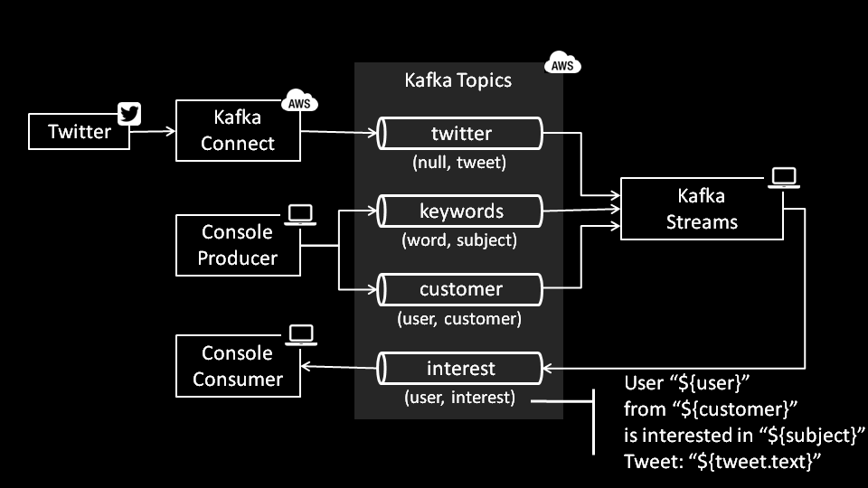

# Twitter Real Time Interest Monitor Demo

This simple demo can be used to interactively demonstrate real-time Apache Kafka integration capabilities in front of an audience.
During the demo, the audience is asked to publish tweets containing specific keywords, which will be shown live on the screen.

The use case is pictured below.

1. A customer or prospect tweets about something she finds interesting.
2. Our stream processing algorithm on top of Kafka notices and alerts us immediately.
3. We beat the competition and offer the right solution.


The figure below shows in more detail how it works.

 - Kafka Connect is used to read tweets from Twitter and write them into the topic "twitter".
 - Topics "keywords" and "customer" are manually filled with the console producer (command line).
 - A Kafka Streams Java application (this project) reads from the three input topics and joins their streams, inputting data to the "interest" topic.




## Prerequisites

In order to run this demo, the following aspects need to be taken care of.

### Obtain Twitter API Key and user accounts

In order to read tweets, you need to sign up at the Twitter developer website (https://apps.twitter.com/).
Twitter uses OAuth 1, which is kind of deprecated, but tool support is OK.

Note down the following strings:

- Consumer key
- Consumer secret
- Token
- Token secret

You need to get all participants Twitter accounts. In my case I wrote HR who already had such a list (thanks, MKU+SBR!).
You can also use the Twitter APIs to look for people quickly.

It's important that you have both the screen names and the numerical user id. You can use the Users Lookup endpoint to get the id based on the screen name (https://api.twitter.com/1.1/users/lookup.json?screen_name=ipt_ch). I used Postman (https://www.getpostman.com/) to access the Twitter API.

### Install Confluent (includes Apache Kafka)

In order to run this demo, you need a running Kafka cluster consisting of:

- Kafka brokers
- Schema registry
- Zookeeper
- Kafka Connect (can be run from any node)

Probably the easiest way to have it all setup is to use the Confluent quick start template on AWS. You have to pay for the infrastructure. It works out of the box with all you need, but by default does not allow access from external networks.

Of course you can also use the Docker images and install it wherever you fell like.

### Create topics

Run the following from any node that has Confluent installed, replacing 3.3.3.3 with the hostname or IP address of a Zookeeper node. You can change the number of partitions and replication factor according to your needs.

```
kafka-topics --zookeeper 3.3.3.3 --create --partitions 9 --replication-factor 3 --topic twitter
kafka-topics --zookeeper 3.3.3.3 --create --partitions 9 --replication-factor 3 --topic keywords
kafka-topics --zookeeper 3.3.3.3 --create --partitions 9 --replication-factor 3 --topic customer
kafka-topics --zookeeper 3.3.3.3 --create --partitions 9 --replication-factor 3 --topic interest
```

### Kafka Connect configuration

In order to set up Kafka Connect, you need to edit the two properties files located at src/main/resources/connect according to the comments that are identified with \[ipt\].

Then you can start Kafka Connect by using something like the following on any node where Confluent is installed:

```
nohup connect-standalone connect-source-standalone.properties twitter-source.properties & tail -f nohup.out
```

Starting it as a service on boot is left to the student as an exercise ;)

### Add static data on two topics

The "customer" and "keywords" topics are filled manually. They have keys and values as simple strings.
Example data is found in src/main/resources/data.
You can do something like the following to input the text files to the topics:

```
kafka-console-producer  --broker-list 1.1.1.1:9092 -topic customer --property "parse.key=true" < customer.txt
kafka-console-producer  --broker-list 1.1.1.1:9092 -topic keywords --property "parse.key=true" < keywords.txt
```

Replace 1.1.1.1 above with the hostname or IP address of one or more brokers (one is enough).

### Read from topics

You can use the console consumer to peek into the topics and make sure all is fine.

The two topics with text content (customer, keywords) can be read with:

```
kafka-console-consumer  --bootstrap-server 1.1.1.1:9092 --from-beginning --property print.key=true --topic customer
kafka-console-consumer  --bootstrap-server 1.1.1.1:9092 --from-beginning --property print.key=true --topic keywords
```

The ones with Avro (twitter, interest).

```
kafka-avro-console-consumer  --bootstrap-server 1.1.1.1:9092 -topic interest --property schema.registry.url='http://2.2.2.2:8081' --from-beginning|jq
```

Replace 1.1.1.1 above with the hostname or IP address of one or more brokers (one is enough), and 2.2.2.2 with the schema registry.

Using jq is recommended to pretty print JSON on the console.

## Compiling

Just use mvn compile. Then you are good to run it.

## Author

[Fabio Hecht](https://github.com/fabiohecht), while working for [ipt - Famous for Integration](https://www.ipt.ch).
